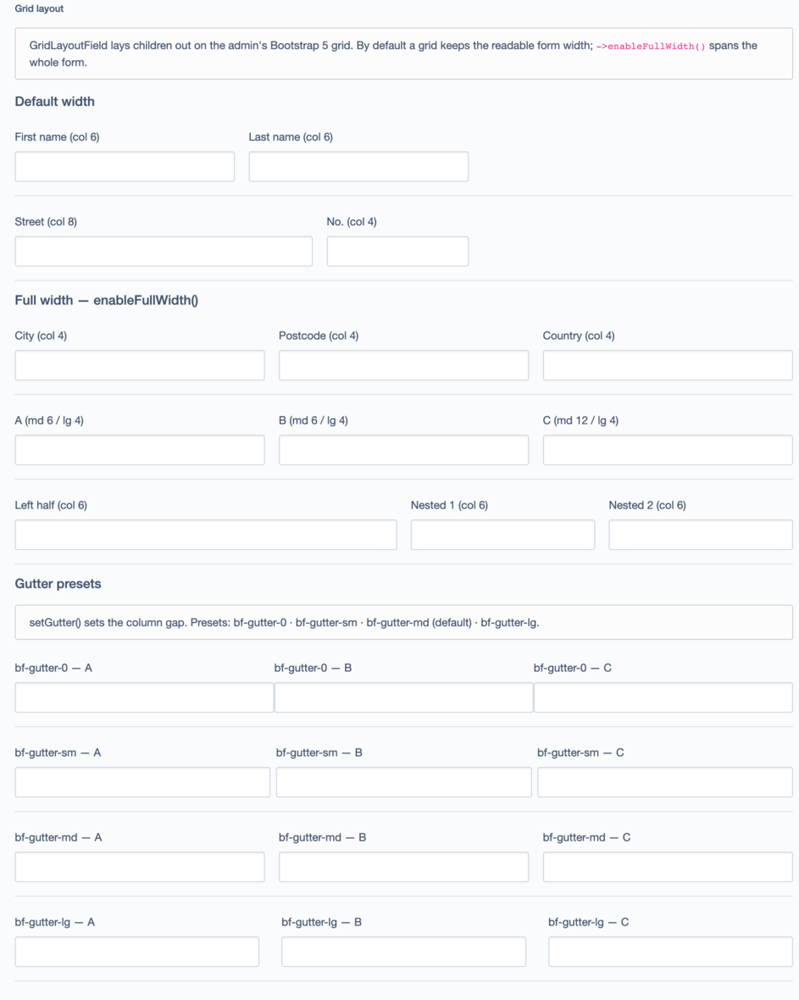
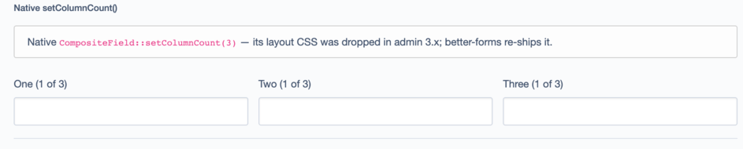
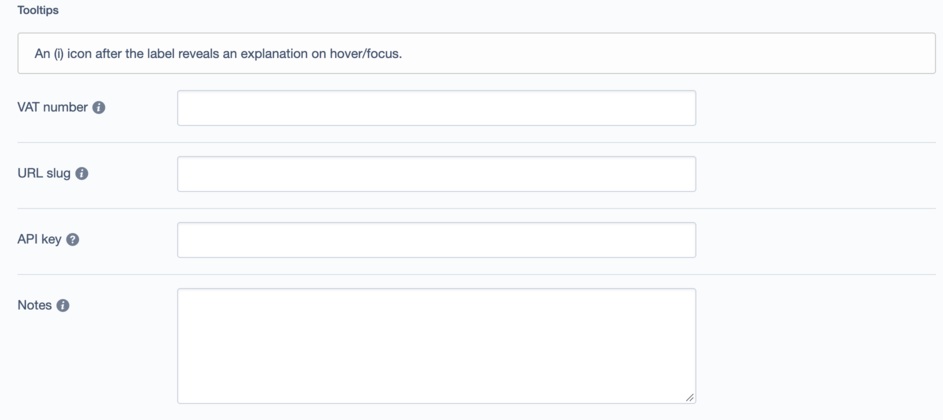
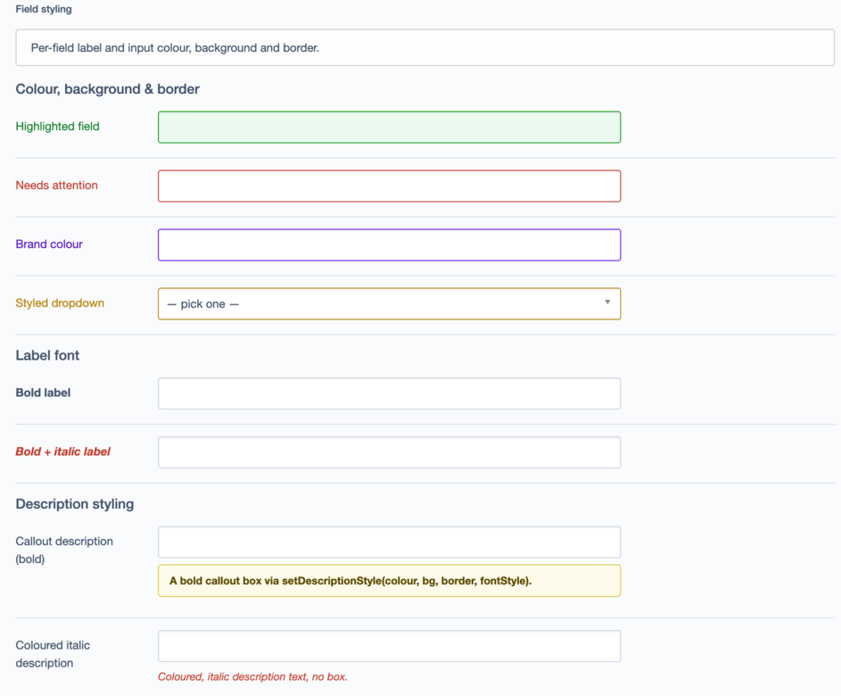
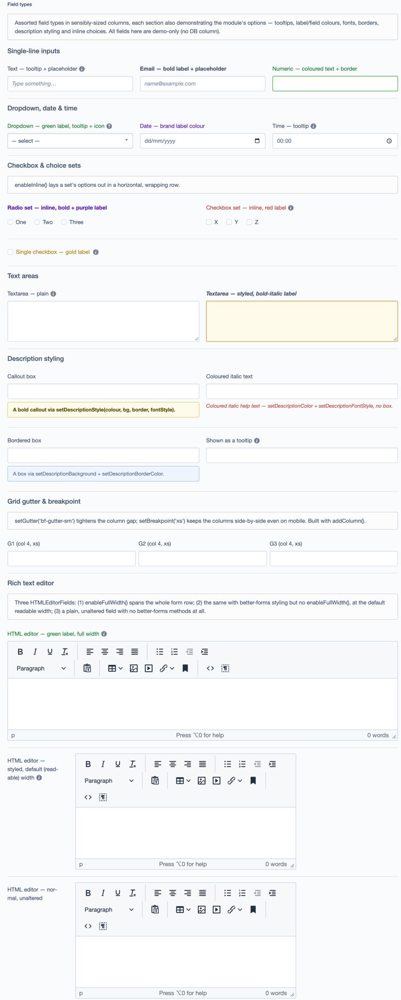

# Silverstripe Better Forms

Nicer CMS forms with a small, chainable PHP API. Most features are just a little CSS + JS injected
into the admin — no `dev/build` needed — and the grid field is a normal form field.

- **Grid layout** — lay fields out in responsive columns with a `GridLayoutField`, driving the
  Bootstrap 5 grid that `silverstripe/admin` already ships.
- **Help tooltips** — a small **(i)** icon after a label that reveals an explanation on hover/focus.
- **Placeholders** — `setPlaceholder()` on any field (Silverstripe core only has it on searchable
  dropdowns).
- **Field styling** — label colour & font, input text / background / border colour, inline option
  sets, and a full-width break-out.
- **Description styling** — colour, callout box and font style for a field's description.

## Requirements

- `silverstripe/framework` ^6.0
- `silverstripe/admin` ^3.0

## Installation

```sh
composer require xddesigners/silverstripe-better-forms
```

---

## 1. Grid layout

`GridLayoutField` is a `CompositeField` whose children are placed in Bootstrap columns. Give it
fields and a column map, or add fields with their span inline.

```php
use XD\BetterForms\Forms\GridLayoutField;
use SilverStripe\Forms\TextField;

$fields->addFieldToTab('Root.Main', GridLayoutField::create('NameRow', [
    TextField::create('FirstName', 'First name'),
    TextField::create('LastName', 'Last name'),
])->setColumns([
    'FirstName' => 6,   // col-md-6
    'LastName'  => 6,
]));
```

Spans may be a bare int (applied at the default breakpoint, `md`) or a per-breakpoint map:

```php
GridLayoutField::create('Address')
    ->addColumn(TextField::create('Street'), ['md' => 8, 'lg' => 9])
    ->addColumn(TextField::create('Number'), ['md' => 4, 'lg' => 3]);
```

By default a grid keeps the admin's readable width (like a normal field). Call `enableFullWidth()`
to break it out to the whole form row — handy for wide, column-heavy layouts:

```php
GridLayoutField::create('WideRow', [
    TextField::create('City'), TextField::create('Zip'), TextField::create('Country'),
])->setColumns(['City' => 4, 'Zip' => 4, 'Country' => 4])
  ->enableFullWidth();
```

Helpers:

| Method | Does |
| --- | --- |
| `setColumns(['Field' => 6, ...])` | Assign spans to existing children by name (int, or `['md'=>8]`). |
| `addColumn($field, 6 \| ['md'=>8])` | Push a field with its span. |
| `setGutter('bf-gutter-sm')` | Column gap. Presets: `bf-gutter-0` · `bf-gutter-sm` · `bf-gutter-md` (default) · `bf-gutter-lg`. A Bootstrap `g-*` class works too. |
| `setBreakpoint('md')` | Breakpoint used for bare-int spans (use `xs` for always-on columns). |
| `enableFullWidth()` | Span the whole form row instead of the readable-width column. |

Nest `GridLayoutField`s for more complex layouts. Columns stack on narrow screens, per Bootstrap.



### Bonus: `setColumnCount()` works again

Silverstripe's native `CompositeField::setColumnCount(n)` lost its layout CSS in `silverstripe/admin`
3.x. This module re-ships it, so the zero-config equal-columns option works too:

```php
CompositeField::create($fieldA, $fieldB, $fieldC)->setColumnCount(3);
```



---

## 2. Help tooltips

Add an **(i)** icon after any field's label:

```php
TextField::create('VAT', 'VAT number')
    ->setTooltip('Include the country prefix, e.g. NL123456789B01');
```

Prefer to reuse the field's existing description as the tooltip (keeps the form uncluttered):

```php
TextField::create('Slug')
    ->setDescription('Lowercase, no spaces — used in the URL.')
    ->convertDescriptionToTooltip();
```

…or do that for **every** field in the CMS, from YAML:

```yaml
XD\BetterForms\BetterForms:
  descriptions_as_tooltips: true
```

The icon is a CMS font-icon (`info-circled` by default). Change it globally or per field:

```yaml
XD\BetterForms\BetterForms:
  info_icon: 'help-circled'
```

```php
$field->setInfoIcon('help-circled');            // another CMS font-icon
$field->setInfoIcon('fa-solid fa-circle-info'); // or Font Awesome (see below)
```



---

## 3. Placeholders

Silverstripe has no `setPlaceholder()` on plain text fields — this adds one to every field:

```php
TextField::create('Name', 'Name')->setPlaceholder('e.g. Jane Doe');
EmailField::create('Email', 'Email')->setPlaceholder('name@example.com');
```

---

## 4. Field styling

Chainable setters on any field. **Label** colour and font:

```php
$field->setLabelColor('#c0392b')
      ->setLabelFontStyle('bold');   // 'bold' | 'italic' | 'bold italic' | 'normal'
```

**Input** text, background and border colour (text inputs, textareas and selects, incl. Chosen):

```php
TextField::create('Price', 'Price')
    ->setFieldColor('#111')             // input text colour
    ->setFieldBackground('#fffbea')     // input background
    ->setFieldBorderColor('#c0392b');   // input border colour
```

**Full width** — break any field out of the admin's ~58% readable-width cap so its control spans the
whole form row (the label sits on its own line above). Great for an `HTMLEditorField` or `GridField`:

```php
HTMLEditorField::create('Content')->enableFullWidth();
```

**Inline option sets** — lay an `OptionsetField`'s or `CheckboxSetField`'s options out in a
horizontal, wrapping row instead of stacked vertically:

```php
OptionsetField::create('Size', 'Size', ['s' => 'S', 'm' => 'M', 'l' => 'L'])->enableInline();
```



---

## 5. Description styling

Colour the description text, set its font style, or turn it into a padded callout box:

```php
// coloured, italic help text
$field->setDescriptionColor('#c0392b')
      ->setDescriptionFontStyle('italic');  // 'bold' | 'italic' | 'bold italic' | 'normal'

// a background and/or border turns the description into a padded callout box
$field->setDescriptionBackground('#fffbea')
      ->setDescriptionBorderColor('#e0c84a');

// …or set it all in one call: setDescriptionStyle($color, $background, $borderColor, $fontStyle)
// (any argument may be null)
$field->setDescriptionStyle('#5a4a00', '#fffbea', '#e0c84a', 'bold');
```

---

## Accessibility

- **Tooltips** are built to be accessible: the trigger is a real focusable `<button>`, its text is
  exposed to screen readers via `aria-describedby`, and the bubble is keyboard-operable — it shows a
  visible focus ring, stays open while hovered, and is dismissible with <kbd>Esc</kbd>
  ([WCAG 1.4.13](https://www.w3.org/WAI/WCAG22/Understanding/content-on-hover-or-focus)). That said, a
  tooltip is the right home only for a **brief, non-essential** hint. Anything a user needs to complete
  the field should stay a **visible description** — so reach for `descriptions_as_tooltips` /
  `convertDescriptionToTooltip()` to declutter optional help, not to hide required instructions.
- **Colours are yours, so is the contrast.** `setLabelColor` / `setFieldColor` / `setFieldBackground`
  / `setFieldBorderColor` / `setDescription…` apply exactly what you pass. Keep text at **≥ 4.5:1** and
  borders at **≥ 3:1** against their background
  ([1.4.3](https://www.w3.org/TR/WCAG22/#contrast-minimum) /
  [1.4.11](https://www.w3.org/TR/WCAG22/#non-text-contrast)), and never let colour alone carry meaning
  (e.g. a red border for “required” or “invalid”) — pair it with text or an icon
  ([1.4.1](https://www.w3.org/TR/WCAG22/#use-of-color)).
- **Placeholders are example values, not labels.** `setPlaceholder()` adds a native `placeholder`,
  which vanishes once the user types and often renders below the contrast minimum — so keep a real
  label (Silverstripe renders one) and never use the placeholder as the only hint.

---

## API reference

All setters return the field, so they chain.

### `GridLayoutField` (extends `CompositeField`)

| Method | Does |
| --- | --- |
| `setColumns(array $map)` | Spans for existing children by name. |
| `addColumn(FormField $field, int\|array $span)` | Push a field with its span. |
| `setGutter(string $gutter)` | Gutter preset (`bf-gutter-0\|sm\|md\|lg`) or Bootstrap `g-*`. |
| `setBreakpoint(string $breakpoint)` | Default breakpoint for bare-int spans. |
| `enableFullWidth(bool $enabled = true)` | Span the whole form row. |

### Every `FormField` (via extension)

| Method | Does |
| --- | --- |
| `setTooltip(string $text)` | Show an (i) tooltip after the label. |
| `convertDescriptionToTooltip(bool $enabled = true)` | Render the field's description as the tooltip. |
| `setInfoIcon(string $icon)` | Override the tooltip icon (CMS font-icon or `fa-*`). |
| `setPlaceholder(string $text)` | Set the input's native placeholder. |
| `setLabelColor(string $color)` | Colour the label. |
| `setLabelFontStyle(string $style)` | Label font: `bold` / `italic` / `bold italic` / `normal`. |
| `setFieldColor(string $color)` | Input text colour. |
| `setFieldBackground(string $color)` | Input background colour. |
| `setFieldBorderColor(string $color)` | Input border colour. |
| `setDescriptionColor(string $color)` | Description text colour. |
| `setDescriptionBackground(string $color)` | Description background (→ callout box). |
| `setDescriptionBorderColor(string $color)` | Description border (→ callout box). |
| `setDescriptionFontStyle(string $style)` | Description font style. |
| `setDescriptionStyle(?$color, ?$background, ?$borderColor, ?$fontStyle)` | All description styling in one call. |
| `enableInline(bool $enabled = true)` | Horizontal options for Optionset/CheckboxSet. |
| `enableFullWidth(bool $enabled = true)` | Break the field out to the full form width. |

---

## Full example

Every option exercised on one form — the demo page's **Field types** tab:



---

## Font Awesome (optional)

Only needed if you pass `fa-*` classes to `setInfoIcon()`.

```yaml
XD\BetterForms\BetterForms:
  include_fontawesome_free: true                 # Font Awesome Free from cdnjs
  # fontawesome_css: 'https://kit.fontawesome.com/XXXX.css'  # …or your own Pro kit
```

## Theming (CSS variables)

Override the tooltip look in your admin CSS:

```css
:root {
    --bf-tip-bg: #43536d;
    --bf-tip-color: #fff;
    --bf-tip-max-width: 260px;
}
```

## License

BSD-3-Clause.
